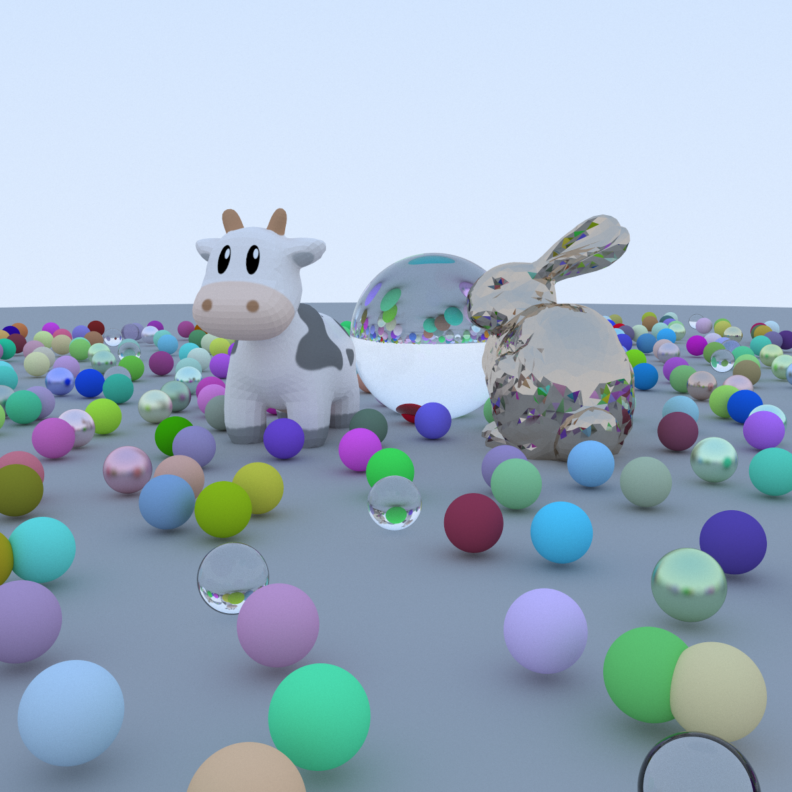

# 太极图形课S1-带BVH与纹理映射的光线追踪

## 作业来源
作业思路来自太极图形课第7讲给出的candidate topic，
在[示例代码](https://github.com/taichiCourse01/taichi_ray_tracing)的基础上
增加了BVH结构加速求交，并加上了简单的纹理映射，原理参考了[GAMES101课程](https://sites.cs.ucsb.edu/~lingqi/teaching/games101.html)的第7讲与第14讲的内容。

## 运行方式

#### 运行环境：
`[Taichi] version 0.8.5, llvm 10.0.0, commit 45c6ad48, win, python 3.7.0`

#### 运行：
安装依赖
```bash
pip install -r requirements.txt
```
运行程序
```python
python main.py
```
main.py运行完毕后将在目录下生成image.png作为渲染结果。

## 效果展示
渲染效果如下，参考了[Ray Tracing in One Weekend]()中的构图，把其中两个大球分别替换成了金属的Stanford Bunny以及GAMES101课程中使用的奶牛模型。


## 整体结构
```
.
|-- LICENSE
|-- README.md
|-- BVH.py
|-- bounds3.py
|-- camera.py
|-- image.png
|-- image_highres.png
|-- main.py
|-- material.py
|-- ray.py
|-- renderer.py
|-- requirements.txt
|-- scene.py
|-- sphere.py
|-- triangle.py
|-- utils.py
`-- data
    |-- bunny.obj
    |-- earthmap.jpg
    `-- spot
        |-- README.txt
        |-- hmap.jpg
        |-- spot_control_mesh.obj
        |-- spot_quadrangulated.obj
        |-- spot_texture.png
        |-- spot_texture.svg
        |-- spot_triangulated.obj
        `-- spot_triangulated_good.obj
```

## 实现细节：

### 设计
代码在示例代码的基础上定义了一系列ti.Struct，如Ray / Sphere / Triangle / Bounds3 / BVHNode等，用于近似OOP的写法。
对于每一类ti.Struct，相应的文件中包含了对应的一系列函数用于操作这些Struct，比如Sphere与Triangle均有init()函数
作为构造函数，均有intersect_p()函数用于求物体与光线的相交情况。

### BVH的实现
BVH的构建涉及到递归的操作，这里我的做法是先在Python域中构建好BVH结构，记录场景包含的物体参数以及BVH节点的信息。在构建完成后将
物体信息与BVH节点的信息一并转移至ti.field中，方便后续在Taichi域中进行访问。这种做法目前存在
的一个问题是构建BVH用时比较长。

BVH由一系列BVHNode组成，BVHNode包含边界框bounds，以及左右子节点的下标left与right，叶子BVH节点还有两个成员：obj_type与obj_idx。
其中obj_type用于指示所包含物体的类型（目前代码中obj_type=0表示sphere, obj_type=1表示triangle）；obj_idx用于指示该物体是相应类别的第几个物体。
obj_type与obj_idx的组合能够用于访问场景中的任一物体。

BVH的查询同样涉及到递归的操作，这里我借鉴了实例代码中实现whitted-style raytracing的方式，使用ti.field模拟堆栈以实现BVH的循环遍历。

### Wavefront Obj文件的读取
代码中使用PyWavefront库用于读取.obj模型文件。main.py中的stanford_bunny()与
games101_cow()函数负责读取两个obj文件。

### 纹理映射
纹理信息在material.py文件中进行定义，读取的纹理图片以ti.field的形式作为全局变量。sphere.py与triangle.py中的get_uc()函数负责计算给定点的纹理坐标，
material.py中的get_texture_value()函数用于查询相应纹理坐标的颜色信息。

## 参考资料
* [tachi-ray-tracing](https://github.com/taichiCourse01/taichi_ray_tracing)
* [GAMES101](https://sites.cs.ucsb.edu/~lingqi/teaching/games101.html)
* [Ray Tracing in One Weekend系列](https://github.com/RayTracing/raytracing.github.io)

